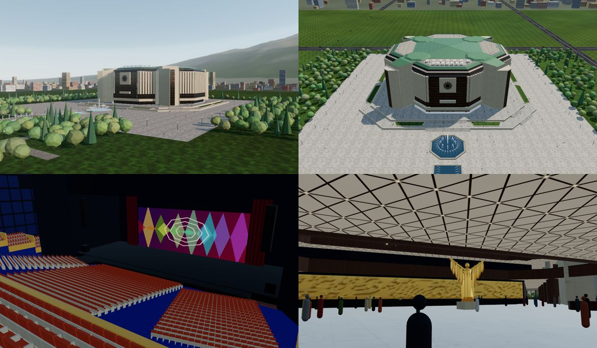

# НДК — National Palace of Culture, Sofia · interactive 3D model

A single self-contained HTML file (`index.html`) with an interactive, explodable 3D model of the
National Palace of Culture (НДК) in Sofia, built to scale from the architects' own plans. It has an
animated construction timeline running from the 1978 groundbreaking to the grand opening on
31 March 1981.

## Open it

Open `index.html` in a recent browser (Chrome, Edge, Firefox or Safari) on a desktop, tablet or
phone. The page needs WebGL 2 and an internet connection: Three.js (r160) loads from
`cdn.jsdelivr.net`, and fonts load from Google Fonts. There is no build step. All plan and map
data is embedded in the file.

## Where the geometry comes from

- **Floors 0–8.** Floor plates, walls, glazed partitions, stairs, escalators and columns are
  converted 1:1 from `NDK_Expo_Levels.dwg`, which NDK publishes on
  [ndk.bg › Планове на зали](https://www.ndk.bg/bg/planove-na-zali). The drawing is in centimetres;
  a 1 m exhibition grid confirms the scale. The ten level sheets were aligned to each other by
  cross-correlating the walls of the four lift cores, to within about 10 cm.
- **Levels −1 and −2.** The Azaryan Theatre and its entrance come from the `NDK Level −1/−2 Azaryan`
  PDFs on the same page.
- **Halls.** Positions, shapes and capacities follow the hall plans and pages on
  [ndk.bg › Зали](https://www.ndk.bg/bg/zali):
  - Hall 1: its seating plan.
  - Hall 3: its theatre configuration (four blocks and 322 lodge places).
  - Halls 7, 8, 9: 380 m² each, 7.15 m high.
  - Halls 3.1, 3.2, 3.4 and 10.
  - Halls 4 and 6, and Peroto.
- **Surroundings.** Bulgaria Square, the park, roads, tram tracks, fountains, trees and about 3,800
  buildings of central Sofia come from [OpenStreetMap](https://www.openstreetmap.org), projected
  into the building's frame. © OpenStreetMap contributors, ODbL.
  - The building's axis is 7.8° west of true north. It was found from the symmetry of the palace's
    OSM footprint, which also fixes where the palace sits on the map.
  - The underpass, the Cosmos fountain court and the metro are placed from the OSM layers −1 to −3.

The facades are generated from each floor's outline in the plans. The saw-tooth steps of the
diagonal fronts become the white marble fins in front of bronze glass. The heights between floors
are not in the published plans; they are reconstructed from photographs, the 7.15 m ceilings of
Halls 7–9 and the palace's overall height.

## What's inside

- **The real plan.**
  - A body about 116 m wide, with four white stair cores on the diagonals.
  - The stepped, finned diagonal fronts and the bronze-glass bay on the park side, carrying Georgi
    Chapkanov's sun.
  - A ring of panoramic terraces on level 8, and a copper pyramid over Hall 3.
  - A long single-storey south block, containing Hall 6.
- **Every floor, as drawn.** Explode the model (button or slider) to pull apart the 13 levels, from
  −3 to the roof. Each floor shows its own walls, stairs and columns from the CAD plans. The
  facades move out with their floors.
- **Halls on their real floors** (the Lumière cinema is left out: it is in a separate building
  south-west of the palace), with 6,585 seats placed individually:

  | Hall | Where | Seats |
  | --- | --- | --- |
  | Hall 1 | levels 2–7 | 3,380: a fan-shaped parterre of 2,100 and two balconies, as in NDK's seating plan; 800 m² stage with a revolving disc |
  | Hall 3 | level 7 | 1,200: a stepped octagon, not a rectangle, with side lodges and a wide stair up from level 6 |
  | Halls 7, 8, 9 | level 5 | 260 each: triangular coffered ceilings with bulb chandeliers; a mural in Hall 8; Hall 9 has a balcony on level 6 |
  | Hall 10 | level 8 | 200 |
  | Halls 3.1, 3.2 | level 8 | 100 each |
  | Hall 3.4 | level 8 | meeting room |
  | Hall 4 | level 0 | 120 |
  | Hall 6 | level 0 | 200 |
  | Peroto | level 0 | 102 |
  | Hall 2 · Azaryan Theatre | level −2 | 403, around a round arena stage |

- **The sunken passage in front of the palace.**
  - An octagonal court, 31 × 32 m, opens in the square. The cascade pours into it, and at its
    bottom stands the Cosmos fountain of steel spheres.
  - A covered gallery rings the court.
  - The underpass runs east–west under the square. It has shops, stairs up at both sides and a
    passage north to the M2 station ‘NDK’.
  - On the south side, doors lead to the Azaryan Theatre foyer.
- **Grand foyer.** The gilded ‘Revival’ stands before a golden relief wall, under cascading bulb
  chandeliers in the three-storey atrium.
- **Build 1978 → 81.** A day-by-day animation:
  - The pit is excavated, tower cranes and trucks work the site, and floors are poured level by
    level.
  - The Hall 3 trusses are lifted in, and the marble and glass fronts close floor by floor.
  - Seats are installed and the park is planted, with fireworks at the opening.
  - Live counters track earth moved, concrete, steel and seats.
- **Views and tools.**
  - Realistic, white-maquette and x-ray styles.
  - A section cut.
  - Time of day from dawn to night, with lit windows, coloured fountains and stars.
  - A cinematic tour and camera presets.
  - Click any part for its facts. Selecting an underground part clears the building and the ground
    away so you can see it.

## Controls

**Desktop.** Drag to orbit, right-drag to pan and scroll to zoom. Click a part, or pick it from the
list, to isolate it.

**Phones and tablets.** Drag with one finger to orbit, pinch to zoom and drag with two fingers to
pan. Tap any part for its facts, or tap empty sky to clear the selection.
- The **⚙** button opens the view controls and the **☰** button opens the list of parts.
- They open as bottom sheets in portrait and side drawers in landscape.
- The mode bar at the bottom switches between Explore, Explode and Build.
- Phones get a lighter rendering profile automatically. Add `?hq` to the URL to force full
  quality, or `?low` to force the light profile on a desktop.

Keyboard shortcuts:

| Key | Action |
| --- | --- |
| `E` | Explode |
| `B` | Build |
| `N` | Night |
| `M` | Maquette |
| `X` | X-ray |
| `F` | Fireworks |
| `R` | Reset the view |
| `Esc` | Clear the selection |

## Accuracy

- **1:1 from the sources:** the plan geometry of levels −2 to 8, hall positions and outlines, seat
  counts, the building's footprint and orientation, and the layout of the surroundings.
- **Reconstructed:** the heights between floors, the roofs, the finishes and the interiors of the
  halls. These follow photographs and are not measured drawings.
- **Level −3 is not published.** It is shown as a plant level on a structural grid.
