

# НДК · National Palace of Culture — interactive 3D

**An explodable, to-scale 3D model of the National Palace of Culture in Sofia, built from the
architects' own plans — every floor, every hall, every one of its 6,585 seats, and the whole
construction from the 1978 groundbreaking to the opening night of 31 March 1981.**

### [▶ Open the live model](https://wavequant.github.io/Ndk_model/)

[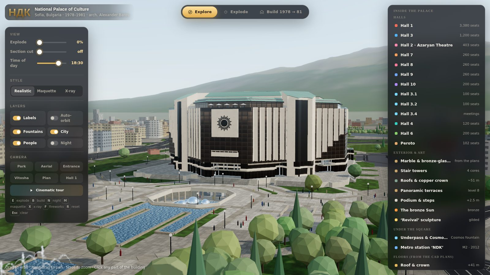](https://wavequant.github.io/Ndk_model/)

## Highlights

- **Built from the real plans.** Floor plates, walls, glazing, stairs and columns of levels 0–8
  come 1:1 from the CAD drawing NDK publishes for event organisers. The Azaryan Theatre comes from
  NDK's plans of levels −1 and −2.
- **Explode it.** Pull the 13 levels apart, from the plant rooms at −3 to the copper crown. Every
  floor carries its own walls, stairs and halls, and the facades move out with their floors.
- **Every hall, every seat.** Thirteen halls sit on their real floors, with 6,585 individually
  placed seats. Click any hall to isolate it and read its facts.
- **Watch it being built.** A day-by-day animation from 1978 to 1981: the pit is dug, cranes
  climb, floors are poured, the Hall 3 trusses are lifted in, the fronts close and the park is
  planted. Live counters track earth, concrete, steel and seats, and it ends with fireworks on
  opening night.
- **Cut it open.** A section plane slices through the whole building. Hall 1's fan of 3,380 seats,
  the stage house and the atrium are all modelled inside.
- **In its city.** Bulgaria Square, the park, the fountains, the underpass, the M2 metro station
  and about 3,800 buildings of central Sofia come from OpenStreetMap, with Vitosha mountain behind.
- **Day, night and styles.** Set the time from dawn to night, with lit windows, coloured fountains
  and stars. Switch between realistic, white-maquette and x-ray looks.
- **Runs anywhere.** One self-contained HTML file of about 850 KB. It works on desktops, tablets
  and phones, and phones get a lighter rendering profile automatically.

## Screenshots

<table>
  <tr>
    <td width="50%">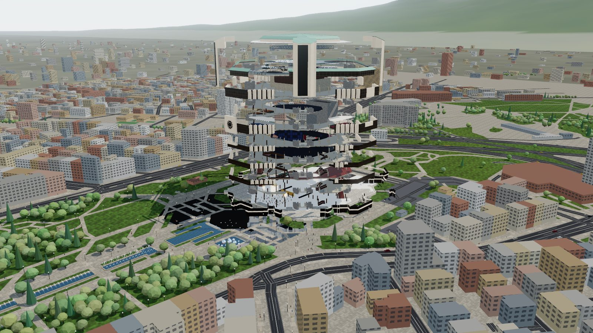 <b>Explode.</b> The 13 levels pulled apart, each carrying the walls, stairs and halls of its CAD sheet.</td>
    <td width="50%">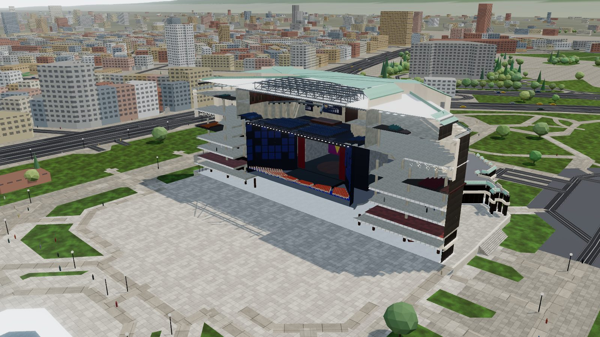 <b>Section cut.</b> Hall 1 with its 3,380 seats, and Hall 3 above it.</td>
  </tr>
  <tr>
    <td>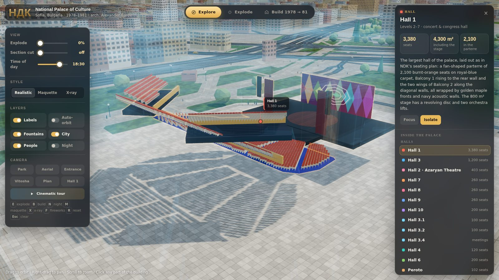 <b>Isolate a hall.</b> Click Hall 1 and it is lifted out of the building, with its facts.</td>
    <td>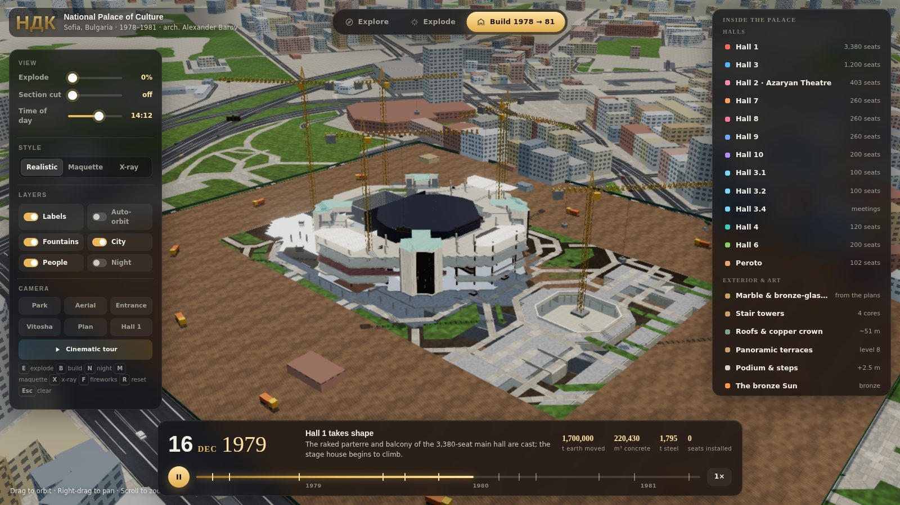 <b>Build 1978 → 81.</b> The construction timeline, with cranes, trucks and live counters.</td>
  </tr>
  <tr>
    <td>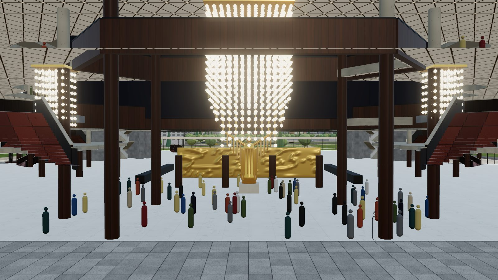 <b>Grand foyer.</b> Bronze-clad columns, cascading bulb chandeliers and Boykov's gilded ‘Revival’.</td>
    <td>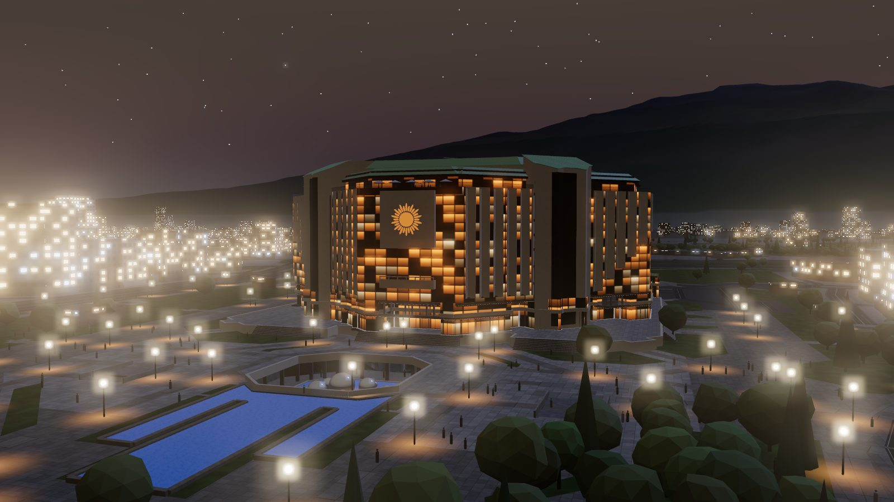 <b>Night.</b> Lit windows, lamps along the park and stars over Sofia.</td>
  </tr>
  <tr>
    <td>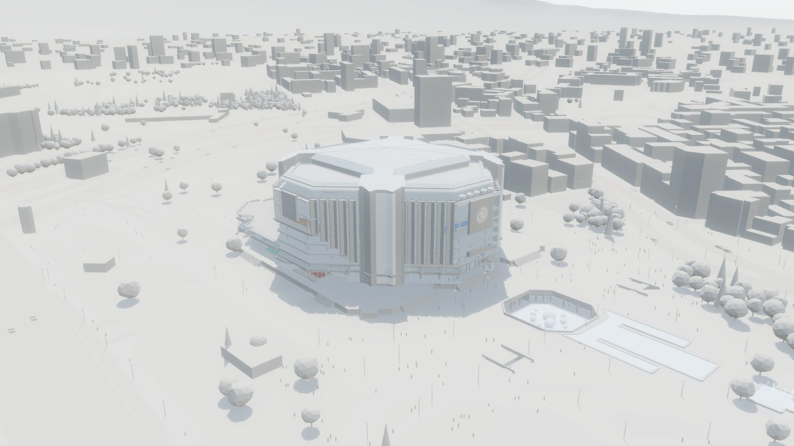 <b>Maquette.</b> A white architectural-model look.</td>
    <td>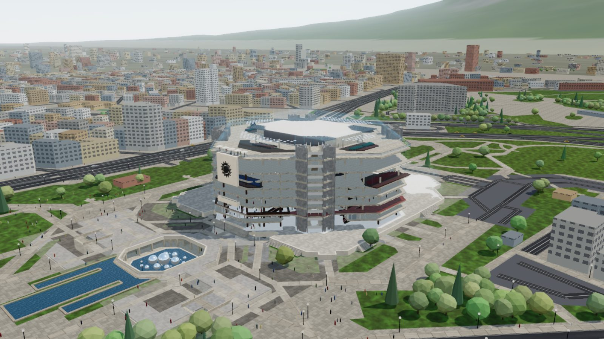 <b>X-ray.</b> See every hall through the building at once.</td>
  </tr>
  <tr>
    <td>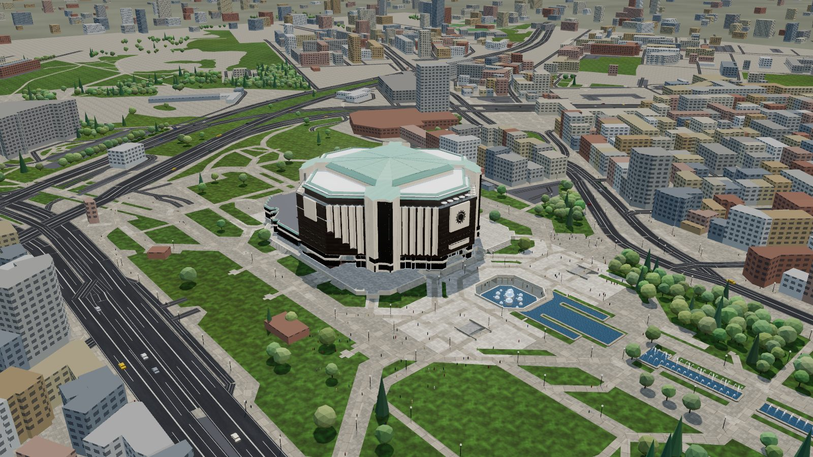 <b>In its city.</b> The park, Bulgaria Square and central Sofia from OpenStreetMap.</td>
    <td align="center">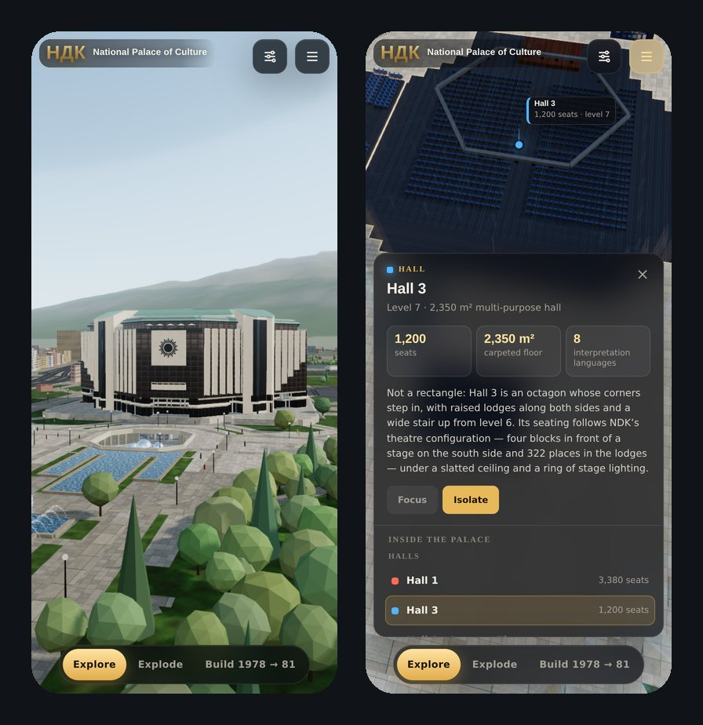 <b>On a phone.</b> Touch controls, bottom sheets and a lighter rendering profile.</td>
  </tr>
</table>

## Open it

- **Online:** <https://wavequant.github.io/Ndk_model/>
- **Offline copy:** download [`index.html`](index.html) and open it in a recent Chrome, Edge,
  Firefox or Safari. There is no build step, and all plan and map data is embedded in the file.

The page needs WebGL 2 and an internet connection: Three.js (r160) loads from `cdn.jsdelivr.net`,
and fonts load from Google Fonts. If a browser refuses to run it from a local file, serve the
folder instead, for example with `python3 -m http.server`, and open <http://localhost:8000>.

URL options:

| Option | Effect |
| --- | --- |
| `?hq` | Force full rendering quality (phones default to a lighter profile). |
| `?low` | Force the light profile on a desktop. |

## Features

### The building

- A body about 116 m wide and 51 m high, with four white stair towers midway along the diagonal
  fronts. Each tower has a tall dark glazed slot and a copper roof that slants up into the crown.
- The finned diagonal fronts: white Y-shaped fins in front of dark bronze glass, running unbroken
  from their feet to the cornice. On the outer wings the feet of the fins climb away from the
  towers.
- The bronze-glass bay on the park side, carrying Georgi Chapkanov's sun on a square white panel,
  with the balcony below it. The south front has its own tall glass bay.
- Square stone panels high on the east and west fronts.
- Roofs in three tiers, each set further in:
  - the cornice of the level 7 panoramic terraces;
  - level 8, under a deep eave and a copper mansard;
  - the crown over Hall 3, with white walls, a copper mansard and a low copper pyramid folded
    along an X and a + of ridges.
- Seen from above, the upper body is a square with cut corners, as in aerial photographs.
- A long single-storey south block, containing Hall 6, and the stone podium with its flights of
  steps.

### Inside

- **Every floor, as drawn.** Each of the 13 levels shows its own walls, glazed partitions, stairs
  and columns from the CAD plans. The square over the basements opens onto the excavation when you
  explode the model, so the underground levels show too.
- **Stairs in 3D.** The stair lines of the plans are read flight by flight and built as solid
  stairs:
  - The four lift and stair cores share one design, with an imperial stair: a wide flight up to a
    landing, then two narrow flights back up on either side. It is the same on every floor from
    level 0 to 8; only the risers change with the storey height.
  - The public stairs have red tile treads between solid dark-bronze parapets with stone caps,
    and climb to where the next floor continues.
  - In the atrium, flights that meet no floor get their own landings.
- **Structural columns** follow the plans and are stacked floor over floor. In the grand-foyer
  atrium they run as single tall bronze-clad shafts.
- **Grand foyer.** The gilded ‘Revival’ by Dimitar Boykov stands before a golden relief wall. Three
  cascading bulb chandeliers hang in a row across the middle of the foyer.
- **The sunken passage in front of the palace.**
  - An octagonal court, 31 × 32 m, opens in the square. The cascade pours into it, and at its
    bottom stands the Cosmos fountain of steel spheres, ringed by a covered gallery.
  - The underpass runs east–west under the square. It has shops, stairs up at both sides and a
    passage north to the M2 station ‘NDK’.
  - On the south side, doors lead to the Azaryan Theatre foyer.

### The halls

Every hall has a stage and a screen showing its name, on the wall its seats face. The Lumière
cinema is left out: it is in a separate building south-west of the palace.

| Hall | Where | Seats |
| --- | --- | --- |
| Hall 1 | levels 2–7 | 3,380: a fan-shaped parterre of 2,100 and two balconies, as in NDK's seating plan; an 800 m² stage with a revolving disc |
| Hall 3 | level 7 | 1,200: a stepped octagon, with side lodges and a wide stair up from level 6 |
| Halls 7, 8, 9 | level 5 | 260 each, under triangular coffered ceilings hung with bulb chandeliers; Hall 8 faces its mural; Hall 9 has a balcony on level 6 |
| Hall 10 | level 8 | 200 |
| Halls 3.1, 3.2 | level 8 | 100 each |
| Hall 3.4 | level 8 | meeting room |
| Hall 4 | level 0 | 120 |
| Hall 6 | level 0 | 200 |
| Peroto | level 0 | 102 |
| Hall 2 · Azaryan Theatre | level −2 | 403, around a round arena stage |

### Build 1978 → 81

A day-by-day animation with a scrubbable timeline and milestones:

- The pit is excavated, and tower cranes and trucks work the site.
- Floors are poured level by level, and the Hall 3 trusses are lifted in.
- The marble and glass fronts close floor by floor.
- Seats are installed and the park is planted.
- Live counters track earth moved, concrete, steel and seats.
- Fireworks mark the opening on 31 March 1981.

### Views and tools

- **Explore, Explode and Build** modes.
- **Explode slider** and a **section cut** that slices the whole model, interiors included.
- **Time of day** from dawn to night, with lit windows, coloured fountains and stars.
- **Realistic, Maquette and X-ray** styles.
- **Layers:** labels, auto-orbit, fountains, city and people.
- **Camera presets** (park, aerial, entrance, Vitosha, plan, Hall 1) and a **cinematic tour**.
- **Click any part** for its facts. Selecting an underground part (level −1 to −3, Hall 2, the
  underpass or the metro) clears the building, the ground and the park away so you can see it.

## Controls

**Desktop.** Drag to orbit, right-drag to pan and scroll to zoom. Click a part, or pick it from the
list, to isolate it.

**Phones and tablets.** Drag with one finger to orbit, pinch to zoom and drag with two fingers to
pan. Tap any part for its facts, or tap empty sky to clear the selection.

- The **⚙** button opens the view controls and the **☰** button opens the list of parts.
- They open as bottom sheets in portrait and side drawers in landscape.
- The mode bar at the bottom switches between Explore, Explode and Build.

| Key | Action |
| --- | --- |
| `E` | Explode |
| `B` | Build |
| `N` | Night |
| `M` | Maquette |
| `X` | X-ray |
| `F` | Fireworks |
| `R` | Reset the view |
| `Esc` | Clear the selection |

## Where the geometry comes from

- **Levels 0–8.** Floor plates, walls, glazed partitions, stairs, escalators and columns are
  converted 1:1 from `NDK_Expo_Levels.dwg`, which NDK publishes on
  [ndk.bg › Планове на зали](https://www.ndk.bg/bg/planove-na-zali). The drawing is in
  centimetres; a 1 m exhibition grid confirms the scale.
  - The level sheets are registered to each other by the structural columns that run through every
    floor, to within about 5 cm, and centred on the building's axis.
  - Level 1's front mezzanine, drawn about 2.6 m out of place on its sheet, is moved onto the
    columns below and above it.
  - The four lift and stair cores are drawn a little differently from sheet to sheet, and level 1
    leaves them out. So all four are built from one drawing, the north-east core of level 5,
    reflected into the other three corners and repeated on every floor.
- **Levels −1 and −2.** The Azaryan Theatre and its entrance come from the
  `NDK Level −1/−2 Azaryan` PDFs on the same page.
- **Halls.** Positions, shapes and capacities follow the hall plans and pages on
  [ndk.bg › Зали](https://www.ndk.bg/bg/zali): Hall 1's seating plan; Hall 3 in its theatre
  configuration (four blocks and 322 lodge places); Halls 7, 8 and 9 at 380 m² and 7.15 m high;
  Halls 3.1, 3.2, 3.4, 10, 4 and 6, and Peroto.
- **Surroundings.** Bulgaria Square, the park, roads, tram tracks, fountains, trees and about 3,800
  buildings of central Sofia come from [OpenStreetMap](https://www.openstreetmap.org), projected
  into the building's frame.
  - The building's axis is 7.8° west of true north, found from the symmetry of the palace's OSM
    footprint, which also fixes where the palace sits on the map.
  - The underpass, the Cosmos fountain court and the metro are placed from the OSM layers −1 to −3.
- **Facades.** They follow one mirror-symmetric line taken from the upper floors' outlines. The
  fins of the diagonal fronts are read from the plans: each is a Y in plan, two 2 m arms opening
  outwards in a V and a short stem inwards, repeating every 4 m along the diagonal. On the outer
  wings the plans add a fin or two per floor, so there the feet of the fins climb away from the
  towers.

## Accuracy

- **1:1 from the sources:** the plan geometry of levels −2 to 8, hall positions and outlines, seat
  counts, the building's footprint and orientation, and the layout of the surroundings.
- **Reconstructed from photographs:** the heights between floors, the roofs and crown, the
  finishes and the interiors of the halls. These are not measured drawings.
  - The south half of the upper body is the north half mirrored, so from above it is a square with
    cut corners, as in aerial photos. The plans draw a recessed south front, which the model fills
    out to that line.
  - The plans draw no fins on the south fronts; there they mirror the north fins.
- **Inferred:** which way each stair climbs, and its landings. The plans show where the flights
  and treads are but not their direction, so each flight climbs towards the side where the floor
  above (or its own floor, for flights in an opening) continues.
- **Level −3 is not published.** It is shown as a plant level on a structural grid.

## How it's made

- **One file.** `index.html` holds the interface, the code and all the data: about 850 KB, with
  the CAD geometry packed as base64 integer segments and the OpenStreetMap layers as compact
  polylines. The only downloads at run time are Three.js and two web fonts.
- **Three.js r160** with physically based materials, soft shadows and bloom. Textures (marble,
  glass, copper seams, carpets, coffers, the park) are drawn procedurally on canvases at start-up,
  so there are no image assets.
- **Instancing** draws the 6,585 seats, the crowds and traffic, the trees and lamps, and the bulbs
  of the chandeliers in a handful of draw calls.
- **Parts and stages.** The model is a set of parts (levels, halls, fronts, towers, roofs…). Each
  part has an explode vector and a list of construction stages with dates, which the timeline
  plays back.
- **Section cut and x-ray** use a shared clipping plane and a ghost shader, applied to every
  material in the scene.
- **Deployment.** [`.github/workflows/pages.yml`](.github/workflows/pages.yml) publishes the page
  and its media to GitHub Pages on every push to the default branch.

## Credits

- **The building:** the National Palace of Culture (Национален дворец на културата, НДК), Sofia,
  1978–1981, by a team led by architect Alexander Barov. The sun on the north front is by sculptor
  Georgi Chapkanov; the gilded ‘Revival’ in the grand foyer is by Dimitar Boykov.
- **Plans:** NDK's published CAD drawing of the exhibition levels and its hall and theatre plans,
  from [ndk.bg](https://www.ndk.bg).
- **Map data:** © [OpenStreetMap](https://www.openstreetmap.org/copyright) contributors, available
  under the Open Database License (ODbL).
- **Libraries and fonts:** [Three.js](https://threejs.org) (MIT), loaded from
  [jsDelivr](https://www.jsdelivr.com); [Manrope](https://fonts.google.com/specimen/Manrope) and
  [Unbounded](https://fonts.google.com/specimen/Unbounded) from Google Fonts (SIL Open Font
  License).

This is an independent project. It is not affiliated with or endorsed by the National Palace of
Culture.
